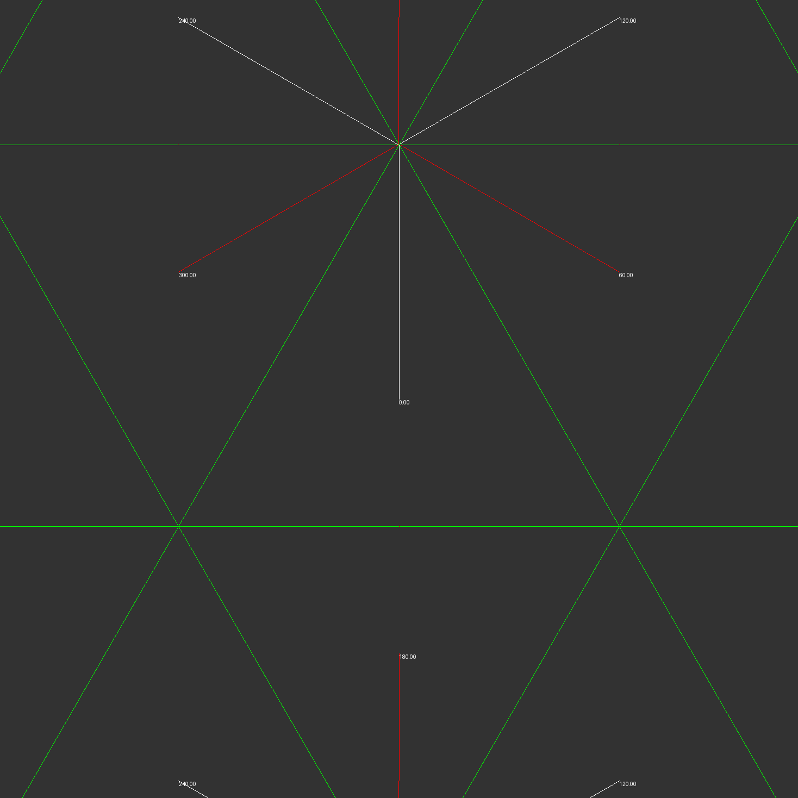
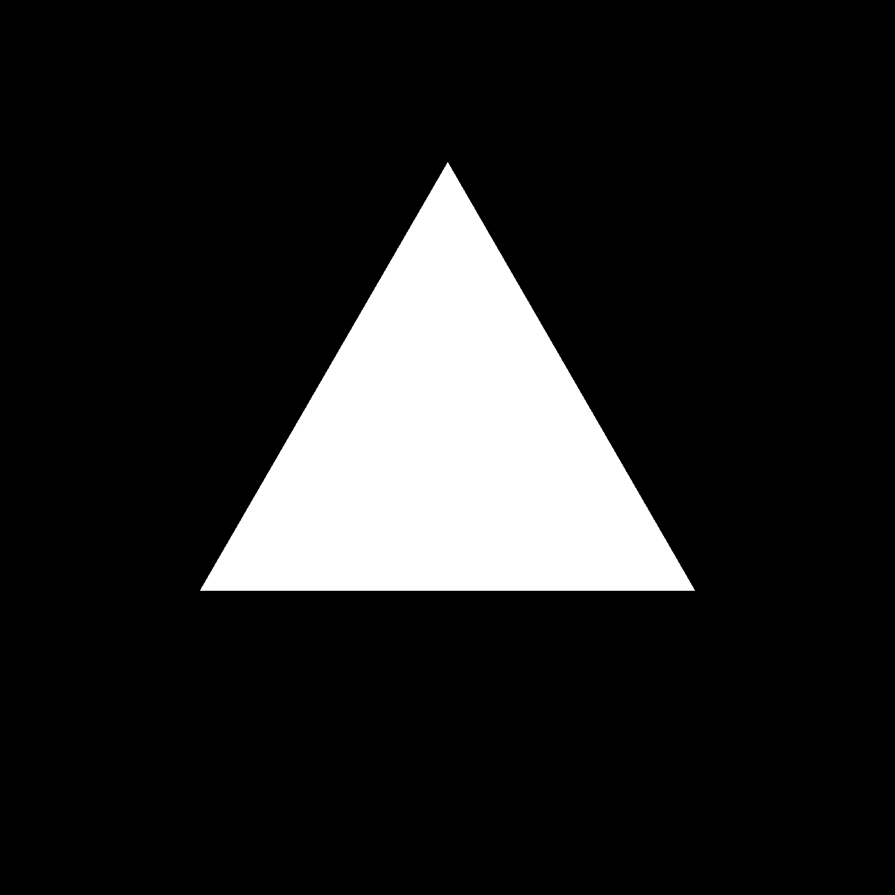

# ff_kaleidoscope
Simple ffmpeg wrapper written in Python to generate a Kaleidoscope effect using the ffmpeg filter graph.
The idea is inspired by [1]. It is more or less a gimmick and may need some manual tweaking. You will need
to install PIL and of course ffmpeg (including ffprobe). Currently only regular tilings (see [2]) of
equilateral triangles are fully supported. Squares and hexagons work more or less, but there are some bugs
with the calculated mirror angles. Other tilings and forms of kaleidoscope (see [3]) should also be possible.
The heavy lifting is done inside of ffmpeg using dozens and hundreds of filters. This also means that it
is rather slow (depending on input/output resolution maybe 1 or 2 fps).

# Steps
Following description and images show the basic steps of this script.

1. Generate regular tiling as Python objects
2. Generate master alpha image with different colors for different tiles (colorkey filter has minimum distance of 0.00001, so this color distance is used)
3. Scale input to fit single tile
4. Prepare all possible rotations/flips of the input that are later used (small optimization)
5. Place a copy of input at center of every tile
6. Add brightness effect to tiles like in a real kaleidoscope
7. Generate alpha mask from master alpha image depending on color for tile (colorkey filter + alphaextract)
8. Apply alpha mask to tile (alphamerge)
9. Combine all streams from all tiles into final image and optionally rotate the image based on time

## Debug image of all tiles

## Master alpha image

## Alpha mask for single tile

## Example input image

## Example output image

# Sources/Links
[1] https://superuser.com/questions/736388/kaleidoscope-effect-with-ffmpeg
[2] https://en.wikipedia.org/wiki/Euclidean_tilings_by_convex_regular_polygons#Regular_tilings
[3] https://en.wikipedia.org/wiki/Kaleidoscope
